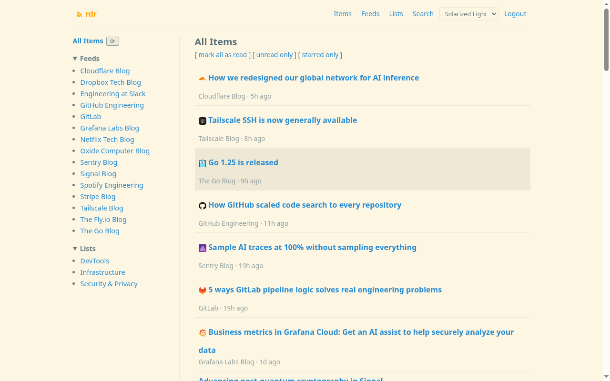
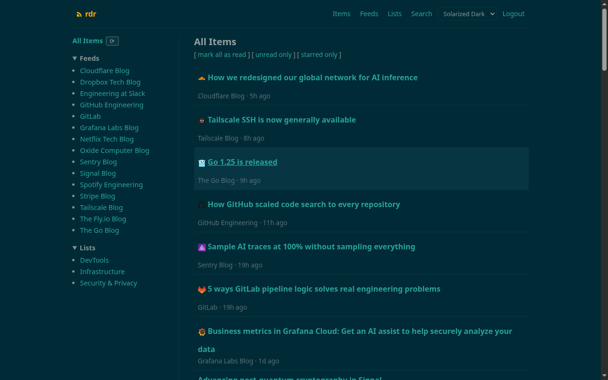

# rdr

A minimalist, self-hosted RSS reader for homelabs.

## About

rdr is a lightweight RSS/Atom feed reader built with Go and SQLite. It runs as
a single binary with no external dependencies, designed for homelab deployment
on trusted networks. The UI is server-rendered HTML with a minimal hand-rolled
stylesheet. A small optional JavaScript file provides keyboard shortcuts as a
progressive enhancement — everything works without it.

## Screenshots

| Solarized Light                              | Solarized Dark                             |
| -------------------------------------------- | ------------------------------------------ |
|   |   |

## Features

- RSS and Atom feed support
- Full-text search across all items (SQLite FTS5)
- Feed organization with lists (a feed belongs to one list)
- OPML import and export (lists exported as folders)
- Four themes: Solarized Light/Dark and Modus Light/Dark (WCAG AAA high-contrast)
- Per-user settings: date display format (relative or absolute), item description previews
- Background feed polling with configurable interval
- Automatic data retention (prune old read items)
- Multi-user support with session-based authentication
- Single binary deployment or Docker
- Keyboard shortcuts for item navigation (vim-style j/k/h/l)
- Mobile-friendly responsive design

## Deployment Model

rdr is designed for homelab and trusted-network deployment. It is not hardened
for direct public-internet exposure.

Open registration is intentional for this environment — a homelab operator
typically wants anyone on the local network to be able to create an account
without an admin approval step. If you expose rdr to the internet, front it
with a reverse proxy that enforces an authentication layer (e.g., HTTP basic
auth, OAuth2 proxy, or similar), and restrict registration accordingly.

HSTS is not configured. If your reverse proxy terminates TLS, configure HSTS
at the proxy layer.

## Quick Start

### Docker

```bash
docker compose up -d
```

This builds the image from the included Dockerfile and starts the service
on port 8080. Open <http://localhost:8080>, register an account, and add
feeds.

### Binary

```bash
./rdr
```

See [INSTALLING.md](INSTALLING.md) for configuration, Docker Compose setup,
and keyboard shortcuts. See [HACKING.md](HACKING.md) for development
instructions.

## License

[MIT](LICENSE)
